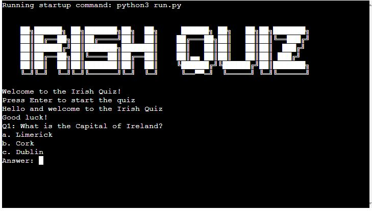
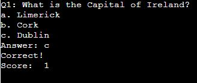
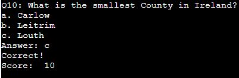
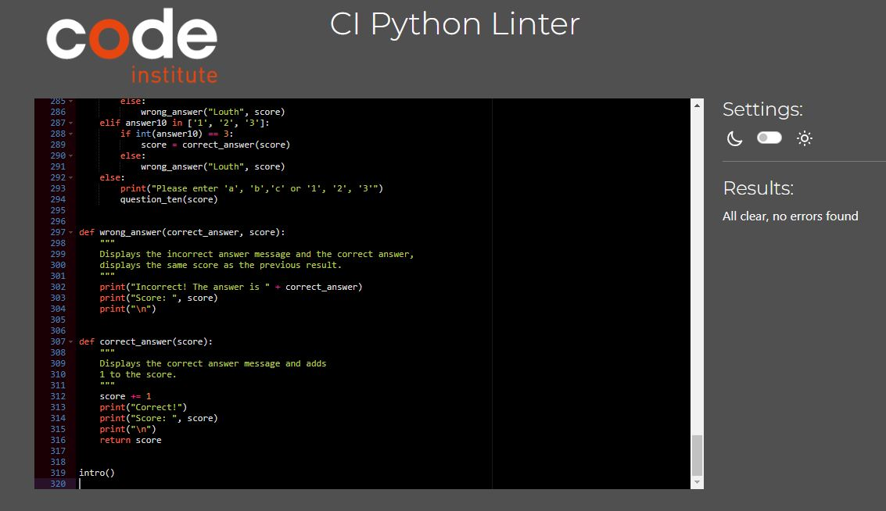

# **Irish Quiz**

**Irish Quiz** is a simple command-line quiz game to test the players knowledge of Ireland. The quiz has ten multi choice questions relating to Ireland. 

## How to Play:

- The game will display the games title "Irish Quiz" in ASCII Art with a welcome message "Welcome to the Irish Quiz!"

- The player is asked to select Enter to play. Once pressed the player will get 2 messages "Hello and welcome to the Irish Quiz" and "Good luck!"

- Once the game begins the player is presented with a series of mulitiple choice questions. To answer a question the player must type the letter or number corresponding with what they think is the correct answer and hit enter.

 

- If the player answers the question correctly they will get a response of "Correct!" and their score will increase by one.

- If the player gets a question wrong they will get a response of "Incorrect! The answer is " and their score will remain the same.

 

- If the player tries to type the answer in or selects a letter or number other than a, b, c, or 1, 2, 3, they will get a response "Please enter 'a', 'b', 'c' or '1', '2', '3'" and the question will repeat itself. 

- The game will continue with the next question until you have completed all ten questions and a final score is given. 

- After the quiz is complete the player will be asked if they want to play again. They can only choose either yes or no. Yes and the games goes back to question one with the score reset. If no the game will goes back to the welcome screen. If the player types anything else in a message will appear to say "Please enter yes or no"

## Features:

- **Interactive Game** The game offers an interactive gaming experience, allowing the player to choose an answer and received a response straight back. 

- **Mulitple Choice Questions** The player is presented with 10 multiple choice questions about Ireland. Each question tests the player knowledge on Ireland. 

- **Informative** If the player gets a question wrong, the game tells the player they got it wrong and provides the player with the correct answer. 

- **Score** The players score is tracked throughout the game and increases for each correct answer. 

- **Play Again Feature** Once the player answers all ten questions they are giving the options of playing again. 

## Design:

- I originally designed a rough flow chart with a very simple design. Once the website was built and was working made some changes to make it flow better and give the player a better experience. 

## Testing:

- I have manaully tested the project using CI Python Linter with no errors showing. 

- I have used bothe my local termianl and the Heroku website to run the quiz with no errors shwing up. 

## Bugs:

- Ran into an issue with my code when the options were only 1-3, I tried to put in a try statement which should have stopped the player from progressing if they typed in anything but 1-3 but this didnt work fully. It stopped them from type in a letter but they could still type in numbers other than 1-3. If they did this it wouldnt give them any score or an incorrect or correct message and would just skip onto the next question. After multiple attempts at trying to fix it I eventually found a way for it to work. This allows the player to pick either a, b, c, or 1, 2, 3,. Anything else it would give them an error advised them to select either a, b, c, or 1, 2, 3,. 

- From the above bug I couldn't find a way to limit the options of what the player could choose and the response as a function. No matter what why I tried it I kept getting errors. This is something I wish to look at again when I have more experience with Python. 

## Deployment:

This project was deployed using Heroku. 
- steps for deployment:
    - Create a new Heroku app
    - Set the builds to Python and NodeJS in that order
    - Link the Heroku app to my repository
    - Click Deploy

## Credits:

- The Code Institute Love-Sandwiches Project help me learn a lot about Python. 

- The (www.w3schools.com) website helped with trying to figure out how to use the correct code and how to get it to work for me. 

- Slack chats - When I was really struggling I was able to ask other students for help. 

## Content:

- The ASCII came from the (www.asciiart.eu) website. 
- Flow Chart was designed using the (https://app.diagrams.net/) website